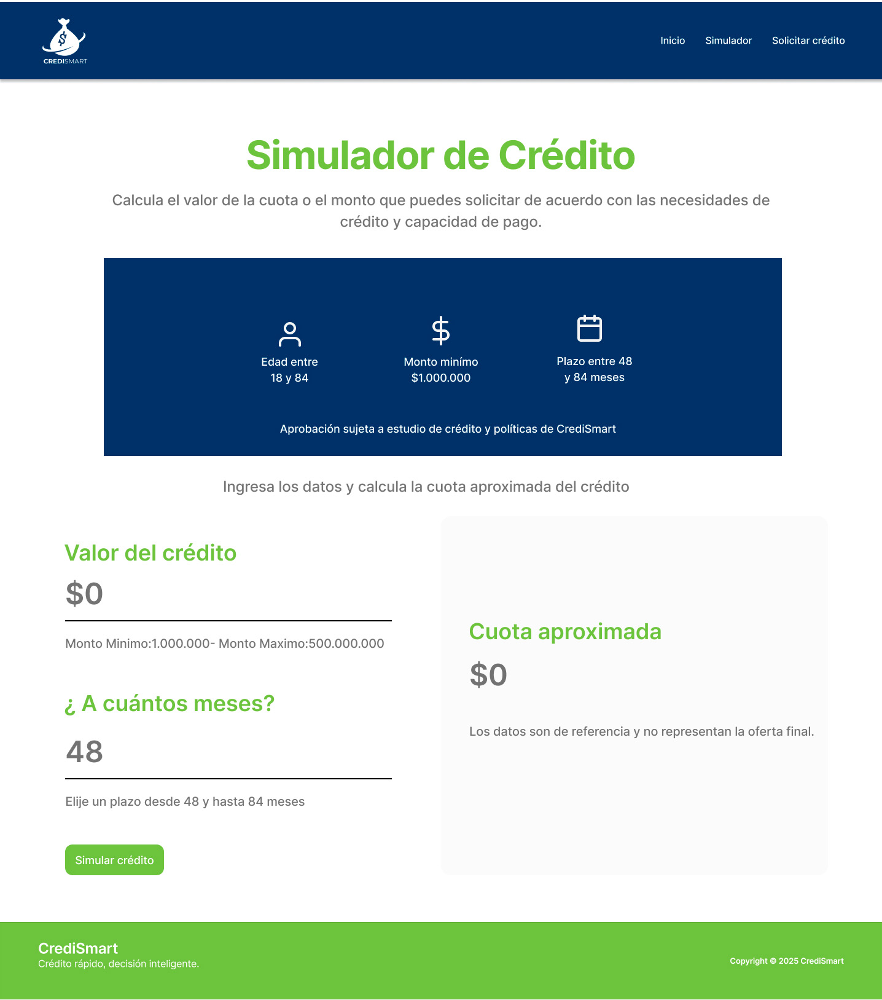

# 💳 Proyecto Credismart

---

## 👩‍💻 Nombre del estudiante
**Monica Duque Posso**

---

## 📝 Descripción breve del proyecto
Este proyecto corresponde a la **Actividad 1 del curso Ingeniería Web**.  
Consiste en la creación de una página web para la empresa **Credismart**, que incluye tres secciones principales:

1. Página de inicio  
2. Simulador de crédito  
3. Formulario de solicitud de crédito  

---

## 🗂️ Estructura de archivos

CrediSmart/
│
├── index.html
├── simulador.html
├── solicitar.html
├── styles.css
├── simulador.js
└── /imagenes

---

## ⚙️ Instrucciones para ejecutar el proyecto

1. Descarga o clona este repositorio.  
2. Abre el archivo **index.html** en tu navegador web preferido.  
3. Navega entre las páginas para explorar todas las funciones del sitio.

---

## 📸 Capturas de pantalla

### 🏠 Página de inicio

---

### 💰 Simulador de crédito

---

### 📝 Solicitud de crédito

---

© 2025 | Proyecto académico - Ingeniería Web | IUDigital
